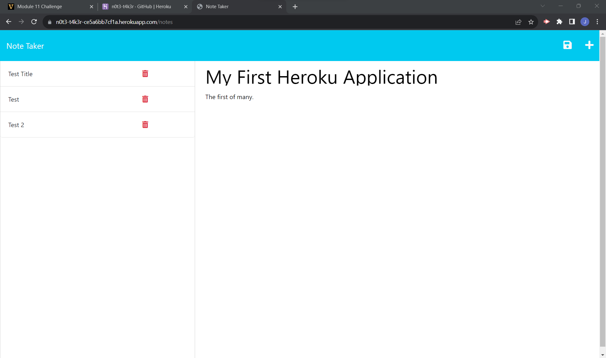

# Note-Taker

  ## Description
  This application allows the user to write and save notes

  - WHEN the application is ran
  - THEN the user is prompted with a landing page and a button to Get Started

  - WHEN the user clicks the Get Started button
  - THEN the user is taken to a second landing page where notes can be created and saved

  - WHEN the user populates the form with content
  - THEN the user can click the save icon, and the note is stored in a column on the left of the page

  - WHEN the user clicks on previously saved notes
  - THEN the user is presented with that note in the main viewport

  ## Table of Contents
  - [Installation](#installation)
  - [Usage](#usage)
  - [Contributing](#contributing)
  - [Questions](#questions)
  - [Link](#link-to-site)

  ## Installation
  Via node.js and npm

  ## Usage
  Via Heroku

  ## Contributing
  Contribution unavailable at this time

  ## Questions
  Please email questions to joseph.s.foster@icloud.com.
  For additional works, please visit [https://github.com/joseph-s-foster]

  ## Link to Site
  https://n0t3-t4k3r-ce5a6bb7cf1a.herokuapp.com/

  
